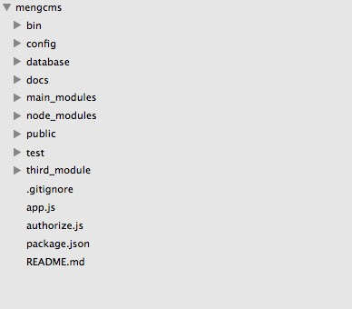

#### 项目目录结构

**详解**:

---

* bin 项目启动文件

* config 项目需要的配置文件, 例如: [database.json](../config/database.json), [redis.json](../config/redis.json)

* database 数据库管理, 例如: [migration.js](../database/migration.js) 

* docs 说明文档

* main_modules 主模块,所有子模块都存在此文件夹中, 例如: [main.js](../main_modules/main.js)  

* node_modules 依赖模块

* public 公用的静态文件

* test 单元测试

* third_modules 第三方模块, 例如: 七牛, 短信, 微信

* app.js 程序入口

* authorize.js 简单权限控制模块

* package.json 依赖管理

* README.md 说明文档入口

**深入了解系列教程**:

---

* [深入main_modules]()
* [深入third_modules]()
* [深入authorize.js]()
* [深入public]()
* [深入config]()
* [深入database]()

**重要文件说明**:

---

1. _database.json_:   MySQL数据库配置(默认使用MySQL)
2. _redis.json_: Redis配置
3. _migration.js_: 同步数据结构到数据库(程序启动默认调用)
4. _main.js_: 子模块自动扫描注册

	